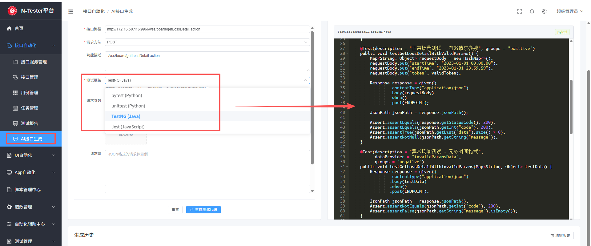

快速启动指南

项目介绍
该项目采用 前后端分离架构，融合 Python 后端框架 FastAPI 和前端主流框架 Vue3 实现统一开发，提供了一站式开箱即用的体验平台
打造AI结合，支持AI生成用例生成，AI 接口测试脚本一键生成，需求评审，需求拆分，基于拆分生成用例，接口自动化，APP自动化，UI自动化，智能排版，LLM厂商自定义配置的一体化管理平台。

## 技术架构

后端：
FastAPI / Uvicorn / Pydantic 2.0 /  Tortoise ORM
AI：大语言模型（LLM）、LangChain、多种嵌入服务（OpenAI、Azure OpenAI、Ollama等）

存储：可切换为 PostgreSQL / MySQL

前端： Vue3 / Vite / TypeScript/ElementPlus

AI技术栈：LangChain/LangGraph

向量数据库：

MCP :fastmcp、mcp

## 环境要求

- Python 3.11
- MySQL 8.0+
- Node.js 18+ (前端)

## 在线体验

地址：http://106.54.166.76/login
用户：admin1
密码：123456
注意：由于给的是超级管理员权限，请不要改密码，不要改密码

## Docker一键部署

查看对于的docker详细配置文件

## 常规部署如下

### 2.创建MySQL数据库

    数据库名test_platform，编码选择utf8mb4

    查看最大连接数 show variables like 'max_connections';

    设置最大连接数 set global max_connections=16384;

## 一键部署（推荐新手）

### Linux/Mac

```bash
cd backend
chmod +x deploy.sh
./deploy.sh
```

### Windows

```bash
cd backend
deploy.bat
```
## Docker 部署（推荐生产环境）

### 快速启动

```bash
# 使用一键脚本
./start-docker.sh    # Linux/Mac
start-docker.bat     # Windows

# 或手动启动
docker-compose up -d
```

详细说明请查看：[DOCKER.md](../DOCKER.md)

## 源码部署后端&前端启动

### 1. 安装依赖

```bash
后端 
cd backend

# 激活虚拟环境 (Windows)
.venv\Scripts\activate

# 安装依赖
pip install -r requirements.txt

启动：

python main.py

# 或使用 uvicorn
uvicorn main:app --host 0.0.0.0 --port 8018 --reload

前端：

cd frontend

npm install 

npm run dev

生产环境
npm run build
```

### 2. 配置数据库

编辑 `cp .env.example,重命名为 .env` 中的数据库配置：

```python
根据配置，将数据库连接信息填写为自己使用的数据库 mysql ，postgresql

# 数据库配置
# DB_TYPE=mysql
# DB_HOST=mysql
# DB_PORT=3306
# DB_USER=root
# DB_PASSWORD=Rebort
# DB_NAME=test_platform

# PostgreSQL 配置示例（当 DB_TYPE=postgresql 时使用）
DB_TYPE=postgresql
DB_HOST=localhost
DB_PORT=5432
DB_USER=postgres
DB_PASSWORD=Rebort
DB_NAME=test_platform

# 后端服务配置
BACKEND_HOST=0.0.0.0
BACKEND_PORT=8018
JOB_PORT=8019

# AI配置
OPENAI_API_KEY=your_openai_api_key_here
OPENAI_BASE_URL=https://api.openai.com/v1

# 其他配置
TOKEN_SECRET_KEY=localhost
PASSWORD_SECRET_KEY=PASSWORD_password_secret_key

数据库信息填写后执行初始化

python 
```
## 🔄 数据库切换

如需在 MySQL 和 PostgreSQL 之间切换：

### 方式一：

```bash
# 使用切换脚本
python switch_database.py mysql      # 切换到 MySQL
python switch_database.py postgresql # 切换到 PostgreSQL

# 数据库初始化

推荐直接使用 aerich 命令：
1. 首次初始化: 
   python -m aerich init -t app.configs.config.tortoise_orm_conf
   python -m aerich init-db

2. 模型变更后:
   python -m aerich migrate --name 描述
   python -m aerich upgrade

3. 如果不想执行命令，需要手动执行初始化的，可以选择项目根目录下的sql文件，通过mysql工具手动执行（注意：只针对mysql）

```
### 方式二：运行数据库迁移，模型变更时使用

如果是已经初始化过数据库了，改了数据模型，需要重新映射则执行以下步骤

对比变更、并映射到数据库: aerich migrate

把最新版本的数据结构同步到aerich表: aerich upgrade

也可以执行生成迁移文件: python db_manager.py migrate

在应用迁移: python db_manager.py upgrade

### 若要进行UI自动化：

    准备浏览器驱动

    根据要用来做自动化的浏览器的类型下载对应版本的驱动，详见：https://www.selenium.dev/documentation/zh-cn/webdriver/driver_requirements/

    把下载的驱动放到项目外的 browser_drivers 路径下，项目启动时若没有则会自动创建，若项目未启动过，则需手动创建

	给驱动加权限：chmod +x chromedriver

### 生产环境下的一些配置:

    1.把main端口改为8025启动

    2.把job端口改为8026启动

    3.准备好前端包，并在nginx.location / 下指定前端包的路径

    4.直接把项目下的nginx.conf文件替换nginx下的nginx.conf文件

    5.nginx -s reload 重启nginx

### 启动测试平台

    本地开发: 
        运行测试平台主服务              python main.py
        运行定时任务/运行任务调度服务    python -m scheduledtask.job
    
    生产环境:
        项目根目录
        1、给shell加执行权限: chmod 755 start.sh kill.sh
        2、启动项目，执行启动shell: ./start.sh
        3、关闭项目，执行启动shell: ./kill.sh
        注：如果shell报错: -bash: ./kill.sh: /bin/bash^M: bad interpreter: No such file or directory
        需在服务器上打开编辑脚本并保存一下
### 4. 服务器

服务器将在 http://localhost:8018 启动

### 5. 访问 API 文档

打开浏览器访问：
- Swagger UI: http://localhost:8018/docs
- ReDoc: http://localhost:8018/redoc

前端dev将在 http://localhost:8016 启动


### 测试 API 端点

```bash
# 测试健康检查
curl http://localhost:8018/docs

# 测试项目列表 (需要登录)
curl http://localhost:8018/api/aitestrebort/projects
```

## 功能说明

### 1. MCP 配置管理

1. 登录系统
2. 进入 "AI驱动管理模块" -> "MCP 配置"
3. 点击 "新建配置"
4. 填写表单：
   - 配置名称: 测试 MCP 服务器
   - 服务器 URL: http://localhost:8765
   - 传输协议: streamable-http
   - 认证头: (可选) X-API-Key: your-key
5. 点击 "测试连接" 验证配置
6. 点击 "创建" 保存配置

### 2. LLM 配置管理

1. 进入 "AI驱动管理模块" -> "LLM 配置"
2. 点击 "新建配置"
3. 填写表单：
   - 配置名称: OpenAI GPT-4
   - 提供商: openai
   - 模型名称: gpt-4
   - API 密钥: sk-your-key
   - 基础 URL: https://api.openai.com/v1
4. 点击 "测试连接" 验证配置
5. 点击 "创建" 保存配置

### 3. AI 测试用例生成

1. 项目创建，点击进入项目详情页
2. 点击 "AI 生成测试用例"，分离线AI生成，在线AI生成（模型调用）
3. 输入需求描述
4. 选择 LLM 配置
5. 点击 "生成" 获取测试用例
6、在项目详情中，点击AI生成，可以根据需求生成详细的测试用例，支持在线预览，保存在对应模块，在线编辑，导出
7、支持一件将接口生成对应框架类型的接口测试脚本，例如pytest，unittest，TestNG等

### 4.项目管理模块
1.需求管理模块
2.提供本地需求文档上传模块，手动需求写入模块
3.本地文档需求进行拆分评审，对需求拆分进行一键生成对应需求功能的测试用例
4.AI一键评审在线需求

## 常见问题

### 1. 端口被占用

**错误**: `error while attempting to bind on address ('0.0.0.0', 8018)`

**解决**:
```bash
# Windows
netstat -ano | findstr :8018
taskkill /PID <进程ID> /F

# Linux/Mac
lsof -ti:8018 | xargs kill -9
```

### 2. 数据库连接失败

**错误**: `Can't connect to MySQL server`

**解决**:
1. 确认 MySQL 服务正在运行
2. 确认数据库 `test_platform` 已创建

### 3. Tortoise ORM 初始化失败

**错误**: `ConfigurationError: default_connection cannot be None`

**解决**:
- 确保使用的是 Tortoise ORM 0.25.3+
- 检查 `app/hooks/app_hook.py` 使用的是 `Tortoise.init` 而不是 `register_tortoise`

### 4. langchain-mcp-adapters 导入失败

**错误**: `ModuleNotFoundError: No module named 'langchain_mcp_adapters'`

**解决**:
```bash
pip install langchain-mcp-adapters>=0.2.0
```

## 开发建议

### 代码风格

- 使用 Black 格式化 Python 代码
- 使用 ESLint + Prettier 格式化前端代码
- 遵循 PEP 8 编码规范


## 生产部署

### 使用 Gunicorn

```bash
gunicorn main:app -c gunicorn_config_main.py
```

### 使用 Docker

```bash
# 构建镜像
docker build -t aitestrebort-api .

# 运行容器
docker run -d -p 8018:8018 aitestrebort-api
```

### 使用 Nginx 反向代理

```nginx
server {
    listen 80;
    server_name your-domain.com;

    location / {
        proxy_pass http://localhost:8018;
        proxy_set_header Host $host;
        proxy_set_header X-Real-IP $remote_addr;
    }
}
```

## 更多资源

- [完整文档](./README.md)

### 如果对你有帮助，点击star


## 项目关键截图

#### 选择运行环境


#### AI接口自动化代码生成


#### 测试执行进度


#### 测试报告


#### 智能对话页面


#### 自动执行脚本用例页面


## 获取帮助

### 交流群 
### 交流群 1074327520


### 作者微信


如遇到问题，请：
1. 查看日志文件 `logs/`
2. 查看相关文档
3. 提交 Issue

---

**最后更新**: 2026-01-04
**版本**: 1.0.0
