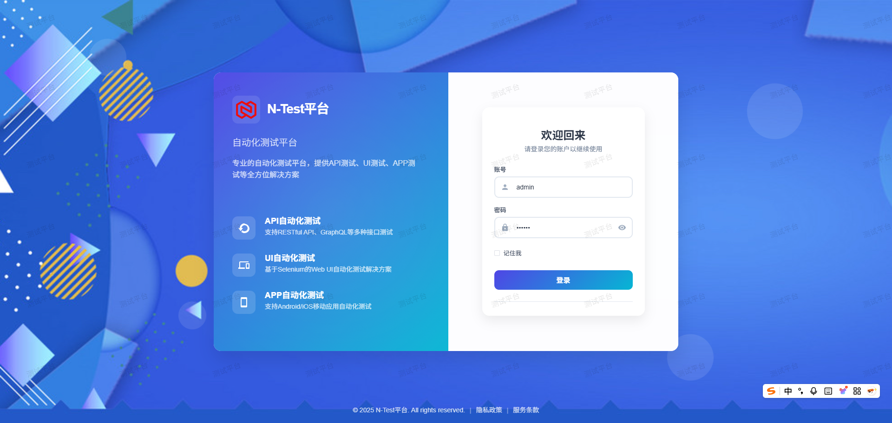
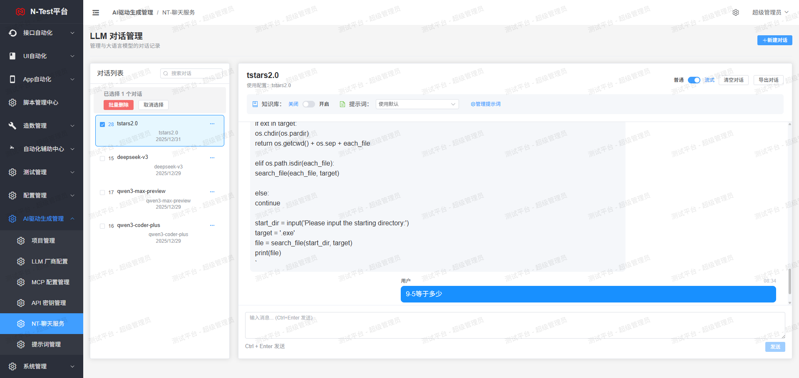

# 快速启动指南

##项目介绍
该项目采用 前后端分离架构，融合 Python 后端框架 FastAPI 和前端主流框架 Vue3 实现统一开发，提供了一站式开箱即用的体验
打造AI结合，支持AI生成用例生成，AI生成接口测试脚本，接口自动化，APP自动化，UI自动化，智能排版，LLM厂商自定义配置的一体化管理平台。

## 技术架构

后端：
FastAPI/ Uvicorn / Pydantic 2.0
前端：
Vue3 / Vite / TypeScript/ElementPlus

## 环境要求

- Python 3.11
- MySQL 8.0+
- Node.js 18+ (前端)

### 2.创建MySQL数据库

    数据库名test_platform，编码选择utf8mb4，对应config.py下db配置为当前数据库信息即可
    查看最大连接数 show variables like 'max_connections';
    设置最大连接数 set global max_connections=16384;

# 数据库初始化指南

## 📋 概述

本指南适用于在新服务器上部署N-Tester测试平台时的数据库初始化操作。支持 MySQL 和 PostgreSQL 两种数据库。

## 🚀 快速开始

### 1. 环境准备

确保以下条件已满足：
- 数据库服务已启动（MySQL 或 PostgreSQL）
- Python 虚拟环境已激活
- 依赖包已安装：`pip install -r requirements.txt`

### 2. 配置数据库连接

项目下cp .env.example 重命名为.env 编辑 `.env` 文件，设置数据库连接信息：

```bash
# MySQL 配置
DB_TYPE=mysql
DB_HOST=localhost
DB_PORT=3306
DB_USER=root
DB_PASSWORD=your_password
DB_NAME=test_platform

# PostgreSQL 配置
DB_TYPE=postgresql
DB_HOST=localhost
DB_PORT=5432
DB_USER=postgres
DB_PASSWORD=your_password
DB_NAME=test_platform
```

### 3. 执行初始化

```bash
# 完整初始化（推荐首次部署使用）
python init_database.py --full

# 或者分步执行
python init_database.py --tables  # 仅创建表结构
python init_database.py --data    # 仅插入默认数据
```

## 📖 命令详解

### 完整初始化
```bash
python init_database.py --full
```
- 创建所有数据库表（101个表）
- 插入默认数据（用户、角色、配置等）
- 验证初始化结果

### 仅创建表结构
```bash
python init_database.py --tables
```
- 仅创建数据库表结构
- 适用于已有数据但需要重建表的情况

### 仅插入默认数据
```bash
python init_database.py --data
```
- 仅插入默认数据
- 适用于表已存在但缺少初始数据的情况

### 检查数据库状态
```bash
python init_database.py --check
```
- 检查数据库连接
- 显示表数量和关键数据统计
- 列出默认用户账号

### 显示帮助
```bash
python init_database.py --help
```

## 👥 默认账号

初始化完成后，系统会创建以下默认账号：

| 角色 | 账号 | 密码 | 权限 |
|------|------|------|------|
| 系统管理员 | admin | 123456 | 所有权限 |
| 业务线负责人 | manager | manager | 业务线管理权限 |
| 测试人员 | tester | tester | 基础测试权限 |

## 📊 初始化内容

### 数据库表（101个）
- **API测试相关**：11个表
- **Web UI测试相关**：12个表
- **App UI测试相关**：14个表
- **AI测试相关**：24个表
- **系统管理相关**：7个表
- **配置管理相关**：6个表
- **需求管理相关**：3个表
- **其他功能表**：24个表

### 默认数据
- **运行环境**：开发、测试、UAT、生产环境
- **权限系统**：66个权限点
- **角色系统**：4个默认角色
- **业务线**：公共业务线
- **用户系统**：3个默认用户
- **配置系统**：14个系统配置
- **脚本模板**：3个函数模板

## 🔧 故障排除

### 1. 数据库连接失败
```bash
# 检查数据库服务状态
# MySQL
sudo systemctl status mysql

# PostgreSQL
sudo systemctl status postgresql

# 检查连接配置
python init_database.py --check
```

### 2. 权限不足
```bash
# 确保数据库用户有创建表的权限
# MySQL
GRANT ALL PRIVILEGES ON test_platform.* TO 'your_user'@'localhost';

# PostgreSQL
GRANT ALL PRIVILEGES ON DATABASE test_platform TO your_user;
```

### 3. 表已存在错误
```bash
# 如果需要重新初始化，先删除数据库
# MySQL
DROP DATABASE test_platform;
CREATE DATABASE test_platform;

# PostgreSQL
DROP DATABASE test_platform;
CREATE DATABASE test_platform;

# 然后重新初始化
python init_database.py --full
```

### 4. 模块导入错误
```bash
# 确保在正确的目录下执行
cd backend

# 确保虚拟环境已激活
source .venv/bin/activate  # Linux/Mac
.venv\Scripts\activate     # Windows

# 安装依赖
pip install -r requirements.txt
```

## 🔄 数据库切换

如需在 MySQL 和 PostgreSQL 之间切换：

```bash
# 使用切换脚本
python switch_database.py mysql      # 切换到 MySQL
python switch_database.py postgresql # 切换到 PostgreSQL

# 重新初始化
python init_database.py --full
```

## 📝 注意事项

1. **首次部署**：建议使用 `--full` 选项进行完整初始化
2. **数据备份**：重要数据请提前备份
3. **权限检查**：确保数据库用户有足够权限
4. **环境变量**：确保 `.env` 文件配置正确
5. **依赖安装**：确保所有 Python 依赖已安装

## 🆘 获取帮助

如遇到问题，可以：
1. 查看详细错误信息
2. 检查数据库日志
3. 使用 `--check` 选项诊断问题
4. 参考项目文档或联系开发团队

---

**初始化完成后，即可启动应用：**
```bash
python main.py
```

访问 `http://localhost:8018` 开始使用测试平台！
## 后端启动

### 3. 运行数据库迁移

>这里直接执行目录下的sql文件手动执行

初始化数据库表结构（项目根目录下依次执行下面命令）：

如果是已经初始化过数据库了，改了数据模型，需要重新映射则执行以下步骤
对比变更、并映射到数据库: aerich migrate
把最新版本的数据结构同步到aerich表: aerich upgrade

### 若要进行UI自动化：

    准备浏览器驱动
    根据要用来做自动化的浏览器的类型下载对应版本的驱动，详见：https://www.selenium.dev/documentation/zh-cn/webdriver/driver_requirements/
    把下载的驱动放到项目外的 browser_drivers 路径下，项目启动时若没有则会自动创建，若项目未启动过，则需手动创建
	给驱动加权限：chmod +x chromedriver

### 生产环境下的一些配置:

    1.把main端口改为8024启动
    2.把job端口改为8025启动
    3.准备好前端包，并在nginx.location / 下指定前端包的路径
    4.直接把项目下的nginx.conf文件替换nginx下的nginx.conf文件
    5.nginx -s reload 重启nginx

### 启动测试平台

    本地开发: 
        运行测试平台主服务              main.py
        运行定时任务/运行任务调度服务     job.py
    
    生产环境:
        项目根目录
        1、给shell加执行权限: chmod 755 start.sh kill.sh
        2、启动项目，执行启动shell: ./start.sh
        3、关闭项目，执行启动shell: ./kill.sh
        注：如果shell报错: -bash: ./kill.sh: /bin/bash^M: bad interpreter: No such file or directory
            需在服务器上打开编辑脚本并保存一下
### 4. 启动服务器

```bash
# 开发模式
python main.py

# 或使用 uvicorn
uvicorn main:app --host 0.0.0.0 --port 8018 --reload
```

服务器将在 http://localhost:8018 启动

### 5. 访问 API 文档

打开浏览器访问：
- Swagger UI: http://localhost:8018/docs
- ReDoc: http://localhost:8018/redoc

## 前端启动

### 1. 安装依赖

```bash
cd frontend
npm install
```

### 2. 启动开发服务器

```bash
npm run dev
```

前端将在 http://localhost:8016 启动


预期输出：
```
🎉 所有测试通过！系统已准备就绪。
```

### 测试 API 端点

```bash
# 测试健康检查
curl http://localhost:8018/docs

# 测试项目列表 (需要登录)
curl http://localhost:8018/api/aitestrebort/projects
```

## 功能验证

### 1. MCP 配置管理

1. 登录系统
2. 进入 "aitestrebort" -> "MCP 配置"
3. 点击 "新建配置"
4. 填写表单：
   - 配置名称: 测试 MCP 服务器
   - 服务器 URL: http://localhost:8765
   - 传输协议: streamable-http
   - 认证头: (可选) X-API-Key: your-key
5. 点击 "测试连接" 验证配置
6. 点击 "创建" 保存配置

### 2. LLM 配置管理(配置模型调用即可使用)

1. 进入 "aitestrebort" -> "LLM 配置"
2. 点击 "新建配置"
3. 填写表单：
   - 配置名称: OpenAI GPT-4
   - 提供商: openai
   - 模型名称: gpt-4
   - API 密钥: sk-your-key
   - 基础 URL: https://api.openai.com/v1
4. 点击 "测试连接" 验证配置
5. 点击 "创建" 保存配置

### 3. AI 测试用例生成

1. 进入项目详情页
2. 点击 "AI 生成测试用例"
3. 输入需求描述
4. 选择 LLM 配置
5. 点击 "生成" 获取测试用例
6. 用例生成后为预览的excel风格，很详细，我们可以点击保存在对应的模块下，支持导出在本地，支持在线进行修改

## 常见问题

### 1. 端口被占用

**错误**: `error while attempting to bind on address ('0.0.0.0', 8018)`

**解决**:
```bash
# Windows
netstat -ano | findstr :8018
taskkill /PID <进程ID> /F

# Linux/Mac
lsof -ti:8018 | xargs kill -9
```

### 2. 数据库连接失败

**错误**: `Can't connect to MySQL server`

**解决**:
1. 确认 MySQL 服务正在运行
2. 检查 `config.py` 中的数据库配置
3. 确认数据库 `test_platform` 已创建

### 3. Tortoise ORM 初始化失败

**错误**: `ConfigurationError: default_connection cannot be None`

**解决**:
- 确保使用的是 Tortoise ORM 0.25.3+
- 检查 `app/hooks/app_hook.py` 使用的是 `Tortoise.init` 而不是 `register_tortoise`

### 4. langchain-mcp-adapters 导入失败

**错误**: `ModuleNotFoundError: No module named 'langchain_mcp_adapters'`

**解决**:
```bash
pip install langchain-mcp-adapters>=0.2.0
```

## 开发建议

### 代码风格

- 使用 Black 格式化 Python 代码
- 使用 ESLint + Prettier 格式化前端代码
- 遵循 PEP 8 编码规范


## 生产部署

### 使用 Gunicorn

```bash
gunicorn main:app -c gunicorn_config_main.py
```

### 使用 Docker

```bash
# 构建镜像
docker build -t aitestrebort-api .

# 运行容器
docker run -d -p 8018:8018 aitestrebort-api
```

### 使用 Nginx 反向代理

```nginx
server {
    listen 80;
    server_name your-domain.com;

    location / {
        proxy_pass http://localhost:8018;
        proxy_set_header Host $host;
        proxy_set_header X-Real-IP $remote_addr;
    }
}
```

## 更多资源

- [完整文档](./README.md)

### 如果对你有帮助，点击star


## 项目关键截图

#### 选择运行环境



#### 测试执行进度


#### 测试报告


#### 智能对话页面



#### 自动执行脚本用例页面


## 获取帮助

### 交流群 


### 作者微信


如遇到问题，请：
1. 查看日志文件 `logs/`
2. 运行集成测试 `python test_mcp_integration.py`
3. 查看相关文档
4. 提交 Issue

---

**最后更新**: 2025-12-31
**版本**: 1.0.0
