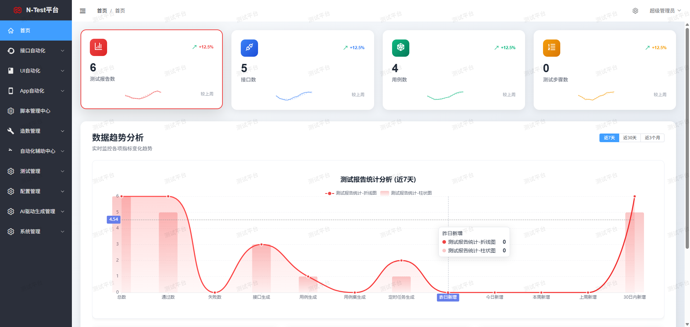
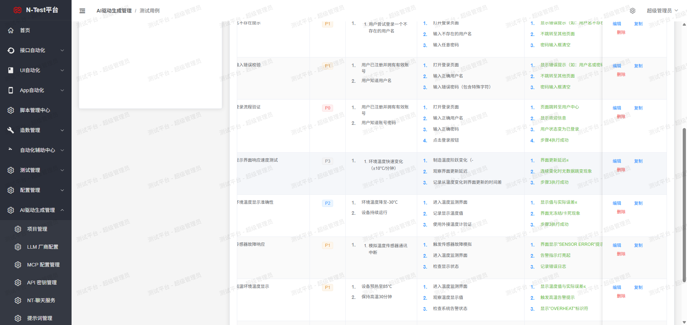
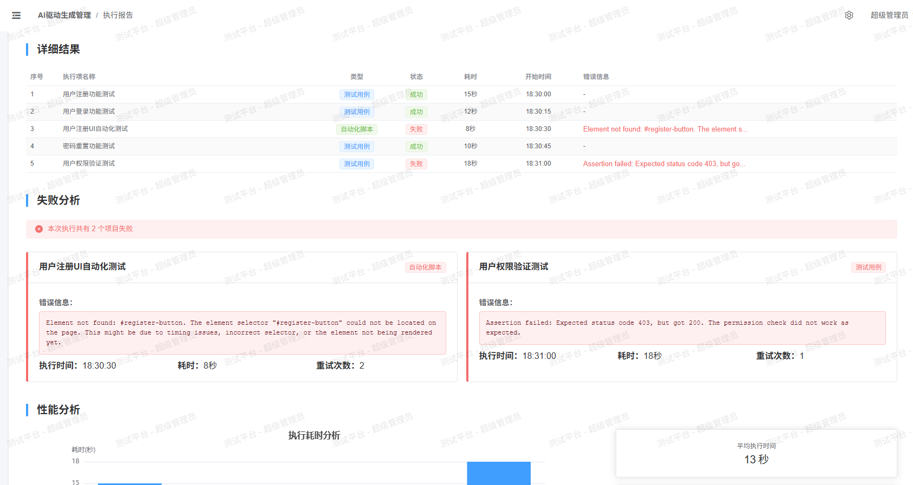

# N-Tester平台前端 - vue3版本

## 步骤

```bash
# 1.安装node18+，确保在 cmd 下 node -v 能出现版本号
# 2.克隆并进入项目目录
# 3.安装依赖
npm install 

或者 
npm install --registry=https://registry.npmmirror.com
# 4.启动服务
npm run dev

# 5.打包部署到生产
npm run build
```

## 项目关键截图

#### 选择运行环境


#### 测试执行进度



#### 测试报告



#### 智能对话页面


#### 自动执行脚本用例页面



## 获取帮助

### 交流群 


### 作者微信

